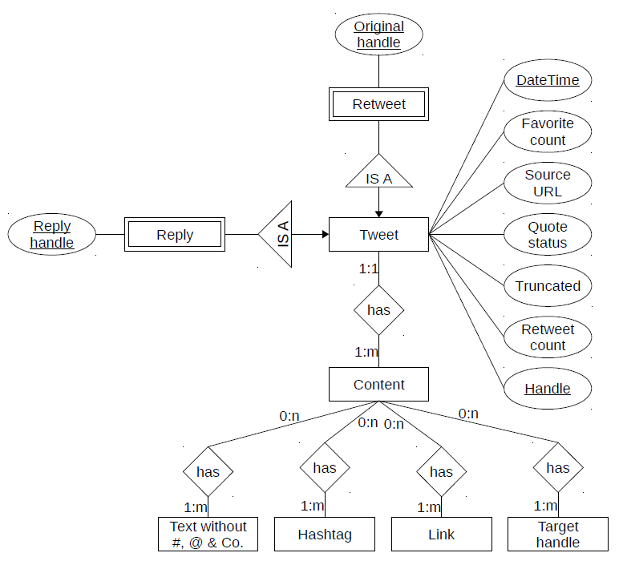

```{r setup, include=FALSE}
knitr::opts_chunk$set(echo = TRUE)
```


# A. Modeling

##1. Project Goal
The main purpose of this project consists in building a database from the data set american-election-tweet.xlsx/.csv such that the following constraints are fulfilled:

  1. Which tweets were the most important?  
  
  2. Which hashtags were used the most?  
  
  3. When did the most hashtags occur?  
  
  4. Wich hashtags frequently occur together?  
  
  5. How has the frequency of special hashtags developed over time?
  
To sum up, the database allows to query for specific information about hashtags and its correlations.

## 2. Exploratory Data Analysis
The data set american-election-tweet.xlsx consists of 6126 entries and 11 attributes. Its eleven attributes are:
{handle, text, is_retweet, original_author, time, in_reply_to_screen_name, is_quote_status, retweet_count, favorite_count, source_url, truncated}

The data set can be split into two subsets in order to compare between tweets on behalf of HillaryClinton and realDonaldTrump. The attributes original_author and in_reply_to_screen_name include only a few entries such that its importance need to be evaluated. 
The attribute truncated showed that only 40 tweets were actually truncated and therefore over 99% of the tweets are complete.

To sum up, the data set was complete except for the attributes original_author and in_reply_to_screen_name. The tweets need to be evaluated for its key words, content for labeling purposes and especially hashtags for later queries.


###2.1. Getting and Exploring the Data
The data set american-election-tweet.xlsx was manually downloaded form <http://kvv.imp.fu-berlin.de> under the subsection ressources from the database course. In the code sections results are mentioned as comments or displayed below the actual command of the function.


```{r overview, warning=FALSE, cache=TRUE}
library(readxl)
data <- read_excel("data/american-election-tweets.xlsx")
#what attributes are available? 11 attributes available
# colnames(data)
# handle, text, is_retweet, original_author, time, in_reply_to_screen_name, 
# is_quote_status, retweet_count, favorite_count, source_url, truncated

# dimension
# dim(data)) # 6126 X 11

# structure of the data
# str(data)

#summary of the data
summary(data)
```


###2.2. Analyzing the Attributes

```{r attributes, warning=FALSE }
handle <- unique(data$handle) # "HillaryClinton"  "realDonaldTrump"

text <- unique(data$text) # many different texts -> further analysis required

is_retweet <- unique(data$is_retweet) # true false

original_author <- unique(data$original_author) # 268 different authors 
# -> further analysis required

timeRange <- range(data$time) # "2016-01-05T03:36:53" "2016-09-28T00:22:34"

in_reply_to_screen_name <- unique(data$in_reply_to_screen_name) 
# NA "HillaryClinton" "Lesdoggg" "elizabethforma" 
# "MaryKayHenry" "montgomeriefdn" "JLo" "POTUS" "tomcolicchio"  

is_quote_status <- unique(data$is_quote_status) # true false

retweet_countRange <- range(data$retweet_count) # 123 490180

favorite_countRange <- range(data$favorite_count) # 274 660384

unique_url <- unique(data$source_url) 
# "https://studio.twitter.com" 
# "http://twitter.com"                          
# "https://about.twitter.com/products/tweetdeck" 
# "http://twitter.com/download/iphone"          
# "http://twitter.com/download/android"          
# "http://twitter.com/#!/download/ipad"         
# "http://instagram.com"                         
# "https://mobile.twitter.com"                  
 
truncated <- unique(data$truncated) # true false
```

```{r naValues, eval=FALSE}
# How many missing values in each attribute from 6126 entries?
sum(is.na(data$handle)) # 0
sum(is.na(data$text)) # 0
sum(is.na(data$is_retweet)) # 0
sum(is.na(data$original_author)) # 5465
sum(is.na(data$time)) # 0
sum(is.na(data$in_reply_to_screen_name)) # 5930
sum(is.na(data$is_quote_status)) # 0
sum(is.na(data$retweet_count)) # 0
sum(is.na(data$favorite_count))  # 0
sum(is.na(data$source_url)) # 0
sum(is.na(data$truncated)) # 0
```


For further information concerning the attributes, please consult <https://dev.twitter.com/overview/api/tweets>.


###
###2.3. Summary of the Attributes

####handle : char/String
It probably refers to the acount to which the tweet was posted. There were only two values for this attribute: HillaryClinton or realDonaldTrump. The domain is therefore equal to {HillaryClinton, realDonaldTrump}.

####text : char/String
Consists of the content of the tweet about only 40 were truncated. The tweets contain simple text, hashtags and further links, such that further analysis is needed. The domain is vast.

####is_retweet : boolean
This attribute shows if a tweet has been retweeted by the authenticating user and consists of the domain {true, false}.

####original_author : char/String
Represents the original author of the tweet to one of both handles. From 6126 entries 5465 were non available (na) and its domain consists of 268 unique String values.


####time : date (POSIX)
The entries in the data set start at '2016-01-05 03:36:53' and stop at '2016-09-28 00:22:34' and is ordered in the reverse order such that in the cleaning process it would be reordered chronologically. The domain ranges between these two time points.


####in_reply_to_screen_name : char/String
Contains the screen name of the original Tweet’s author if it is not a reply to a tweet. 5930 entries were na and its domain consists of {NA, HillaryClinton, Lesdoggg, elizabethforma, MaryKayHenry, montgomeriefdn, JLo, POTUS, tomcolicchio}.

####is_quote_status : boolean
"This field only surfaces when the Tweet is a quote Tweet. This attribute contains the Tweet object of the original Tweet that was quoted" - twitter documentation.
Domain consists of {true, false}

####retweet_count : int
How many times the tweet has been retweeted. Its range is between 123 and 490180 without any na's.

####favorite_count : int
"Indicates approximately how many times this Tweet has been liked by Twitter users" - twitter documentation.
There are no nas and ranges between 274 and 660384.

####source_url : char/String
"Utility used to post the Tweet, as an HTML-formatted string. Tweets from the Twitter website have a source value of web." - twitter documenation
There are 8 unique values, hence its domain consists of {  
[1] "https://studio.twitter.com"                  
[2] "http://twitter.com"                          
[3] "https://about.twitter.com/products/tweetdeck"  
[4] "http://twitter.com/download/iphone"          
[5] "http://twitter.com/download/android"         
[6] "http://twitter.com/#!/download/ipad"         
[7] "http://instagram.com"                        
[8] "https://mobile.twitter.com"
}

####truncated : boolean
Indicates if the tweet is truncated (true) or not (false). Only 40 entries consisted of turncated tweets, such that an accurate text analysis could be performed.
Domain consists of {true, false}.

### Relations
We see that there are two values for handle such that we can split the whole data set into two subsets: HillaryClinton and realDonaldTrump. As the goal of the project remains the analysis of the tweets our model assumption focuses on the text, that includes the hashtags. In correlation with the attributes is_retweet or favorite_count we could measure the impact of the tweets and moreover analyze it in conjunction with original_author, in_reply_to_screen_name and source_url. The essential attribute time will be attributed to each tweet. Further exploratory data analysis will identify crucial points in order to adapt our assumptions and model in the next iterations of our project.

### Tables and Plots
```{r tables, warning=FALSE}
table(data$handle, data$is_retweet)
# table(data$handle, data$original_author) 
# table(data$original_author, data$is_retweet) 
# table(data$truncated) # only 40 tweets were truncated in the dataset

# ranges for the orignal_author to is_retweet
range(table(data$original_author, data$is_retweet)[,2]) 

# represents the distribution of handle's tweets if quoted or not
table(data$handle, data$is_quote_status)
```

```{r timeseries, warning=FALSE, cache=TRUE, echo=FALSE}
#order data set accoriding from oldest to newest
data$time <- strptime(data$time, "%Y-%m-%dT%H:%M:%S")
data <- data[order(data$time),]
data$time <- as.POSIXct(data$time)
```

```{r hidden, echo=FALSE}
# Multiple plot function
#
# ggplot objects can be passed in ..., or to plotlist (as a list of ggplot objects)
# - cols:   Number of columns in layout
# - layout: A matrix specifying the layout. If present, 'cols' is ignored.
#
# If the layout is something like matrix(c(1,2,3,3), nrow=2, byrow=TRUE),
# then plot 1 will go in the upper left, 2 will go in the upper right, and
# 3 will go all the way across the bottom.
#
multiplot <- function(..., plotlist=NULL, file, cols=1, layout=NULL) {
  library(grid)
  
  # Make a list from the ... arguments and plotlist
  plots <- c(list(...), plotlist)
  
  numPlots = length(plots)
  
  # If layout is NULL, then use 'cols' to determine layout
  if (is.null(layout)) {
    # Make the panel
    # ncol: Number of columns of plots
    # nrow: Number of rows needed, calculated from # of cols
    layout <- matrix(seq(1, cols * ceiling(numPlots/cols)),
                     ncol = cols, nrow = ceiling(numPlots/cols))
  }
  
  if (numPlots==1) {
    print(plots[[1]])
    
  } else {
    # Set up the page
    grid.newpage()
    pushViewport(viewport(layout = grid.layout(nrow(layout), ncol(layout))))
    
    # Make each plot, in the correct location
    for (i in 1:numPlots) {
      # Get the i,j matrix positions of the regions that contain this subplot
      matchidx <- as.data.frame(which(layout == i, arr.ind = TRUE))
      
      print(plots[[i]], vp = viewport(layout.pos.row = matchidx$row,
                                      layout.pos.col = matchidx$col))
    }
  }
}
```
```{r plotSeries, warning=FALSE, cache=TRUE, echo=FALSE}
#for 2016!
library(ggplot2)
theme_set(theme_bw())

g1 <- ggplot(aes(x = time, y = retweet_count), data = data) + 
      geom_point() +
      ggtitle("Distribution of Retweet Count")

g2 <- ggplot(aes(x = time, y = favorite_count), data = data) + 
      geom_point() +
      ggtitle("Distribution of Favorite Count")


g3 <- qplot(handle, retweet_count, data = data) + 
      labs(title="Retweet Count between Handles")

# favorite count against handle split into source_url
g4 <- qplot(handle, favorite_count, data = data, facets = .~ source_url) +
      labs(title="Favorite Count between Handles \n Compared to URL Sources") + 
      theme(axis.text.x = element_blank()) +
      xlab("HillaryClinton VS realDonaldTrump")

multiplot(g1, g2, g3, g4, cols=2)
```


## 3. ER Model

Based on our assumptions we decided to build the following ER Model [Figure 1], that puts the emphasis on the tweet text and relates the other attributes around it in an adequate fashion. This allows to query for information in the tweets that will mostly relate to the hashtags. 
The object Content represents the text of the tweet and may include several hashtags, links, targethandle. The rest of the content will be simple plain text without any special characters.
The handle and time attributes could be used to uniquely identify the tweets. If it is determined that a tweet was in response to another one, than the attribute reply_handle will be associated to it. Finally, if the tweet is a retweet, it the attribute original_handle will be included to the tweet representing the original author.
The exact evaluation process for the hashtags relating to different other hashtags will take place in the application. The results will be either cached or additionally attributed to the hashtag object



## 4. Relational Model
The tweet with all its elements will be considered as a unit. The boolean queries for is_retweet (alias retweet) and in_reply_to_screen_name (alias reply) will be externalized in order to optimize queries for speed.
The content is furthermore associated to four classifiers (text without special characters, hashtag, link and target handle) that allows to store the data in an organized fashion. This allows the system to optimize its queries for such content.
The attributes is_quote_status and truncated could be excluded in our use case, but for query purposes they will remain in our model as one attribute, especially as we expect that the user will unlikely postulate such queries.

```{r relationalModel, warning=FALSE, eval=FALSE}
Tweet(DateTime, FavouriteCount, SourceURL, QuoteStatus, Truncated, RetweetCount, Handle),
Content(ID),
Text(ID),
Hashtag(ID, hashtag),
Link(ID, link),
TargetHandle(ID, targetHandle),

Access to the content:
Content is in Tweet(ID, DateTime, Handle)

Boolean queries with a loop, if many elements occur:
Content_Text(Content_ID, Text_ID),   
Content_Hashtag(Content_ID, Hashtag_ID),  
Content_Link(Content_ID, Link_ID),  
Content_TargetHandle(Content_ID, TargetHandle_ID),  

Boolean queries: 
Tweet is Retweet(DateTime, Handle, OriginalHandle)
Tweet is a Reply(DateTime, Handle, ReplyHandle)
```


## 5. Database Creation
```{r createDB, warning=FALSE, eval=FALSE}
createdb Election
```

# B. Data Import

In the second iteration the goals consist in 

1. Creating the database schema  
2. Cleaning the data  
3. Importing the data  
4. Running the web server


## 1. Create the Database Schema
```{r createTables, warning=FALSE, eval=FALSE}
create table Tweet(
    id integer Primary Key,
    datetime timestamp not null,
    favouriteCount integer not null,
    sourceUrl character varying(50) not null,
    quoteStatus boolean not null,
    truncated boolean not null,
    retweetCount integer not null,
    handle character varying(15) not null
);

create table Content(
  id integer Primary key,
  idTweet integer references Tweet (id)
);

create table Text(
  id integer Primary key,
  idContent integer references Content (id),
  plaintext text not null
);

create table Hashtag(
  id integer Primary key,
  idContent integer references Content (id),
  hashtag character varying(20) not null
);

create table Link(
  id integer Primary key,
  idContent integer references Content (id),
  link character varying(45) not null
);

create table TargetHandle(
  id integer Primary key,
  idContent integer references Content (id),
  targetHandle character varying(30) not null
);


create table Retweet(
  id integer Primary key,
  idTweet integer references Tweet (id),
  originalHandle character varying(45) not null
);

create table Reply(
  idTweet integer references Tweet (id),
  replyHandle varchar(15) not null
);

```

Link to the sql files: <https://github.com/basacul/DBAssignment/tree/master/sql>

## 2. Clean the Data
The cleaning of the data is done by the java class DataSanitizer which reads the american-election-tweet.csv file, cleans it and saves it in a new data set sanitized_american_election_tweet.csv. 

Link to the java files: <https://github.com/basacul/DBAssignment/tree/master/java>

## 3. Import the Data
Moreover the java class DataSanitizer populates the tables after reading each cleaned line from the data set and populates the tables which were declared in section 1.Creating the database schema.

Link to the java files: <https://github.com/basacul/DBAssignment/tree/master/java>

## 4. Establish the Web Server

### 1. PostgreSQL

```{r important, warning=FALSE, eval=FALSE}
Put the file 'postgresql-42.1.1.jar' or the newest from 
'https://jdbc.postgresql.org/download.html' into your extensions folder 
of your java install path:

( For Mac f.e. )
cd /Library/Java/Extensions/
```


#### 1.1 start your postgres
```{r postgres, warning=FALSE, eval=FALSE}
( For Mac f.e. with lunchy via brew)
lunchy start postgres
```
	


#### 1.2 Connect the DB in Java
```{r connectJDBC, warning=FALSE, eval=FALSE}
IMPORTANT: Make sure your User ist Admin in Postgres.
( CHECK THIS VIA '\du' if you are in psql)
```

	

### 2. Install Webserver ( on Mac ):
```{r installWebServer, warning=FALSE, eval=FALSE}
sudo ApacheCTL start
```
	
#### 2.1 Install php with homebrew
```{r installHomebrew, warning=FALSE, eval=FALSE}
homebrew install php55
```	


#### 2.2 Change the Apache httpd.conf
```{r configuration, warning=FALSE, eval=FALSE}
Delete '#' of line 
'#LoadModule php5_module libexec/apache2/libphp5.so'

OR ( copy and paste the following line into the conf file)

LoadModule php5_module    

$HOMEBREW_PREFIX/Cellar/php55/5.5.9/libexec/apache2/libphp5.so
```	
	

#### 2.3 Restart Apache
```{r restart apache, eval=FALSE, warning=FALSE}
sudo apachectl restart
```


# C. Data Mining And Visualization

## 1. Develop A Metric And Similarity Between Two Hashatags And Conduct Cluster Analysis (German)

Wir	haben	die	Hashtags	auf	Ähnlichkeit	der	Tweet-Inhalte,	also	dem	gesamten	Kontext, sowie	das	Auftreten	der	Hashtags	untereinander	in	Verbindung	gesetzt. Leider	führt	bei	uns	k-Means	zu	einem	Ergebnis,	welches	sich	kaum	darstellen	lässt	und	Fehler	beinhaltet	(wir	haben	unmengen	von	0-Werten),	weshalb	wir	von	einer	Visualisierung abgesehen	haben	(Datensatz	mit	über	140k	Sätzen/Nodes).	Die	Visualisierung	nehmen	wir	in Aufgabe	2	vor.	Hier	haben	wir	unterschiedliche	Darstellungen	gewählt.	Näher	werden	die	in Aufgabe	2	und	im	Vortrag	besprochen.	
Die	[Code Dateien](https://github.com/basacul/DBAssignment)	sind	unserem	Auftritt	und	dem	git	beigefügt	und	können	dort eingesehen werden.

## 2. Hashtag Network Visualization (German) 

Wir	haben	SigmaJS	heruntergeladen	und	mit	ihren	Features	die	Hashtag-Visualisierung durchgeführt.	Wir	haben	verschiedene	Darstellungen	ausprobiert	mit	zufälliger	Anordnung	der	Hashtags	und	im	Zusammenhang	mit	ihrer	Zeitachse	und	Frequenz.		


In	dieser	Darstellung	werden	die	Hashtags	nur	einmal	aufgeführt	und	die	Kanten	sind	mit weiteren	Hashtags	verbunden,	die	im	gleichen	Tweet	erwähnt	werden.	Die	Anordnung	der	Punkte	wird	mithilfe	eines	Randomgenerators	erzeugt,	wodurch	die	ganze	Bildfläche	besser ausgenutzt	wird	und	angenehmer	zu	betrachten	ist.	

## 3. Visualization Of Occurrences And Incidences Of Hashtags In The Course Of Time (German)


In	dieser	Darstellung	werden	die	alle	Hashtags	nach	Häufigkeit	des	Auftretens	im	zeitlichen	Verlauf	dargestellt.	Die	imaginäre	x-Achse	stellt	die	Zeitachse	von	Januar	bis	September	dar	und	die	imaginäre	y-Achse	die	Anzahl	ihres	Auftretens.	Die	Kanten	widerspiegeln	die	gleiche	Bedeutung	wie	im	ersten	Bild.	
Die	schwach	dargestellte	Linie	im	oberen	rechten	Quadranten	sind	nicht	durch	Kanten	verbunden, sondern	sind	alle	alleinstehende	Hashtags	die	kumuliert	eine	Linie	darstellen.	


In	dieser	Graphik	haben	wir	den	Code	aus	Übung	3	wiederverwendet	und	ihn	im	Zusammenhang	der	neuen	Daten	angepasst.	Die	Daten	werden	durch	eine	Datenbankanfrage	mithilfe	von	psycopg2	in Python	generiert	und	sie	danach	in	eine	json	Datei	gespeichert.	Die	Daten	beinhalten	zwei	Attribute	(Hashtag	und	Monat)	welche	danach	durch	flot-master	benutzt	werden.	Dabei	haben	wir	durch	ein	Dropdown	Menu	die	Möglichkeit	erzeugt,	die	Häufigkeitsdarstellung	verschiedener	Hashtags	darstellen	zu	lassen.		

